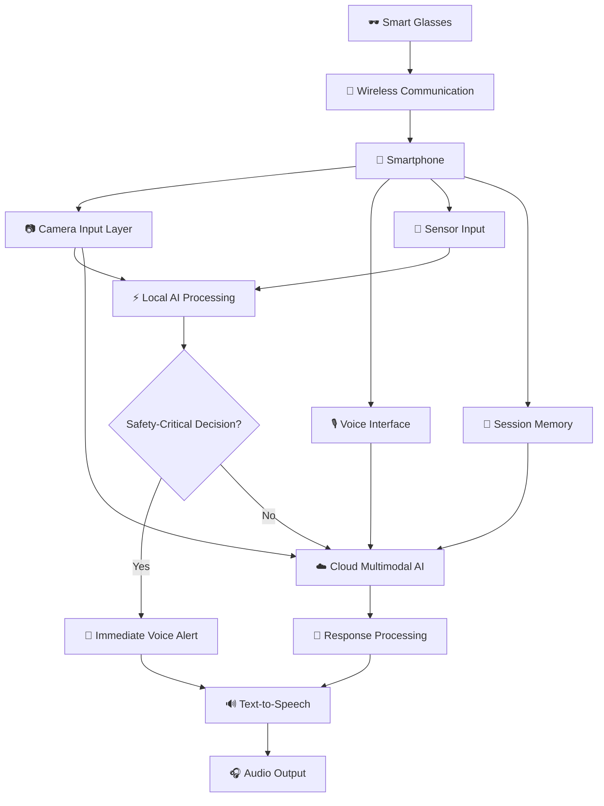

<div align="center">

# 🕶️ Path Guard

### AI-Powered Assistive Smart Glasses for Visually Impaired Users

<p align="center">
  <strong>See the world through intelligent assistance.</strong>
</p>

<p align="center">
  A lightweight, AI-powered assistive system that combines computer vision, sensor fusion, voice interaction, and multimodal AI to help visually impaired users understand and navigate their surroundings.
</p>

<p align="center">


</p>

</div>

---

## 📌 Table of Contents

- [🌟 About the Project](#-about-the-project)
- [🎯 Problem Statement](#-problem-statement)
- [💡 Our Approach](#-our-approach)
- [✨ Key Features](#-key-features)
- [🏗️ System Architecture](#️-system-architecture)
- [🔄 Working Pipeline](#-working-pipeline)
- [🧠 Hybrid AI Strategy](#-hybrid-ai-strategy)
- [🛠️ Technology Stack](#️-technology-stack)
- [📂 Project Structure](#-project-structure)
- [🚀 Getting Started](#-getting-started)
- [⚙️ Configuration](#️-configuration)
- [🧪 Example Use Cases](#-example-use-cases)
- [📊 Performance Evaluation](#-performance-evaluation)
- [🔐 Privacy and Safety](#-privacy-and-safety)
- [🗺️ Development Roadmap](#️-development-roadmap)
- [🤝 Contributing](#-contributing)
- [⚠️ Disclaimer](#️-disclaimer)
- [📄 License](#-license)

---

## 🌟 About the Project

**Path Guard** is an AI-powered assistive smart-glasses project designed to improve environmental awareness and independent mobility for visually impaired users.

The system combines a lightweight wearable device with smartphone-based intelligence. The glasses capture visual and sensor data, while the smartphone performs AI processing, communicates with cloud-based multimodal models when required, and delivers clear voice instructions to the user.

Unlike systems that only identify objects, Path Guard focuses on understanding the surrounding situation and providing useful, actionable assistance.

> **Object detection tells the user what is present.  
> Path Guard aims to explain what is happening and what the user should do next.**

---

## 🎯 Problem Statement

Visually impaired users may face challenges while:

- 🚧 Detecting nearby obstacles
- 🚶 Navigating through unfamiliar environments
- 📄 Reading documents, labels, and signboards
- 💊 Identifying medicine packaging
- 💵 Recognizing currency notes
- 🏠 Understanding indoor and outdoor surroundings
- 🗣️ Accessing information without assistance
- 🔊 Receiving useful information in a simple and accessible format

Many existing solutions provide individual features such as object detection, OCR, or navigation. Path Guard aims to combine these capabilities into one intelligent, context-aware assistant.

---

## 💡 Our Approach

Path Guard uses a **hybrid Edge AI + Cloud AI architecture**.

### 🧩 Lightweight Wearable

The glasses are designed to contain only essential hardware:

- 📷 Camera
- 📡 Wireless communication module
- 📏 Distance sensor
- 🎙️ Microphone
- 🔊 Open-ear or bone-conduction audio output
- 🔋 Lightweight battery

The heavy processing is moved to the smartphone to reduce the weight, size, and power consumption of the glasses.

### 📱 Smartphone as the Intelligence Hub

The smartphone performs:

- Local object detection
- Obstacle detection
- Voice processing
- Navigation intelligence
- Session memory
- Cloud AI communication
- Text-to-speech output

### ☁️ Cloud AI When Required

The cloud-based multimodal AI is used only for advanced tasks such as:

- Scene understanding
- Complex visual questions
- Document explanation
- Contextual reasoning
- Conversational assistance
- Higher-level navigation queries

Continuous video streaming to the cloud is avoided wherever possible.

---

## ✨ Key Features

### 👁️ Real-Time Object Detection

Detects common objects in the user's surroundings using computer vision models.

Possible objects include:

- People
- Vehicles
- Chairs
- Tables
- Doors
- Bags
- Bottles
- Stairs
- Other everyday objects

Example response:

> “There is a chair approximately two meters in front of you.”

---

### 🚧 Obstacle Detection

Combines visual detection with distance sensors to identify nearby obstacles.

The system can generate short and actionable alerts:

- 🛑 “Stop.”
- ⚠️ “Obstacle ahead.”
- ⬅️ “Move slightly left.”
- ➡️ “Move slightly right.”
- ✅ “Path is clear.”

Immediate safety-related decisions are intended to be handled locally for lower latency.

---

### 🌍 Scene Understanding

Uses a multimodal Vision LLM to understand selected camera frames and answer questions such as:

- “What is in front of me?”
- “Describe my surroundings.”
- “Is the path clear?”
- “What objects are near me?”
- “What is this object used for?”
- “Explain what is happening around me.”

This allows the system to move beyond simple object labels and understand the broader context.

---

### 📖 OCR and Smart Reading

Path Guard supports reading:

- Books
- Documents
- Medicine labels
- Product packaging
- Signboards
- Notices
- Printed instructions

#### Direct Reading Mode

```text
Image → OCR → Extracted Text → Text-to-Speech
```

#### Intelligent Reading Mode

```text
Image → OCR → Multimodal LLM → Explanation/Summary → Text-to-Speech
```

For example:

> “Summarize this notice.”  
> “Explain the instructions on this medicine package.”  
> “Read the text on this signboard.”

---

### 💵 Currency Detection

Identifies currency notes and provides the denomination through voice output.

This feature is intended to support independent currency recognition during daily transactions.

---

### 💊 Medicine Detection

Assists users in identifying medicine packaging and reading medicine-related information.

Possible capabilities include:

- Medicine name recognition
- Label reading
- Dosage text extraction
- Packaging identification
- Explanation of printed instructions

> Path Guard is not intended to replace a doctor, pharmacist, or professional medical advice.

---

### 🗣️ Voice-Based Interaction

Users can interact with the system through voice commands.

Example commands:

```text
“What is in front of me?”
“Read this.”
“What medicine is this?”
“Is there an obstacle nearby?”
“Describe the room.”
“Help me navigate.”
“Repeat that.”
“What was the previous object?”
```

---

### 🧭 Intelligent Navigation

The navigation module combines:

- Object detection
- Distance sensors
- GPS location
- Route information
- Environmental context
- Voice instructions

The system is designed to provide simple instructions such as:

- “Continue forward.”
- “Turn left.”
- “Turn right.”
- “Stop.”
- “There is an obstacle ahead.”
- “You are close to your destination.”

---

### 🧠 AI Memory and Conversation Context

Path Guard maintains short-term context to understand follow-up questions.

Example:

```text
User: What is in front of me?

System: There is a chair in front of you.

User: What is it used for?

System: The chair is used for sitting.
```

The memory module can maintain:

- Recent questions
- Previous responses
- Detected objects
- OCR results
- Medicine information
- Navigation instructions
- Recent user commands
- Session context

---

## 🏗️ System Architecture



---

## 🔄 Working Pipeline

```text
📷 Capture Image or Receive Camera Frame
                    ↓
⚡ Run Local Object and Obstacle Detection
                    ↓
🛑 Check for Immediate Safety Alerts
                    ↓
🔊 Provide Local Voice Instruction if Required
                    ↓
🗣️ Process User Voice Command
                    ↓
☁️ Send Selected Frame to Cloud AI if Necessary
                    ↓
🧠 Apply Conversation Context and Memory
                    ↓
📝 Generate a Clear and Actionable Response
                    ↓
🔊 Convert Response into Speech
                    ↓
🎧 Deliver Audio Output to the User
```

---

## 🧠 Hybrid AI Strategy

Path Guard separates fast safety decisions from advanced reasoning.

| Task | Processing Method | Reason |
|---|---|---|
| Nearby obstacle detection | Local AI | Low latency |
| Object detection | Local AI | Fast response |
| Distance-based warning | Local AI | Safety-critical |
| Basic navigation direction | Local AI | Internet-independent |
| Currency detection | Local AI | Fast recognition |
| Medicine detection | Local AI + OCR | Efficient processing |
| Text reading | Local OCR | Quick output |
| Text explanation | Cloud AI | Advanced understanding |
| Scene description | Cloud Vision LLM | Contextual reasoning |
| Complex user questions | Cloud AI | Natural-language intelligence |
| Conversation memory | Smartphone + Backend | Context-aware interaction |

### Why Hybrid AI?

- ⚡ Faster response for safety-related tasks
- 🌐 Reduced dependency on internet connectivity
- 🔋 Lower processing requirements on the glasses
- 🔐 Better privacy through selective cloud requests
- 🧠 Advanced reasoning when required
- 💰 Reduced cloud API usage
- 📱 Easier system maintenance and upgrades

---

## 🛠️ Technology Stack

### Artificial Intelligence

- Python
- YOLO-based object detection
- OpenCV
- TensorFlow / TensorFlow Lite
- OCR
- Speech-to-Text
- Text-to-Speech
- Multimodal Vision LLMs
- Natural Language Processing

### Backend

- FastAPI
- REST APIs
- Python services
- Session management
- Modular AI services

### Cloud AI

The architecture is designed to support multiple multimodal AI providers through a common provider interface.

Potential providers include:

- Qwen Vision
- Gemini Vision
- Other compatible multimodal AI models

### Hardware and IoT

- Lightweight camera module
- ESP32 or similar microcontroller
- ToF or ultrasonic distance sensor
- Microphone
- Open-ear or bone-conduction speaker
- Rechargeable battery
- Wi-Fi / Wi-Fi Direct
- Bluetooth Low Energy

### Development Tools

- Git
- GitHub
- Visual Studio Code
- Python Virtual Environment
- Docker
- Android or smartphone integration tools

---

## 📂 Project Structure

```text
PathGuard/
│
├── README.md
├── requirements.txt
├── .gitignore
├── .env.example
│
├── backend/
│   ├── main.py
│   │
│   ├── routes/
│   │   ├── scene.py
│   │   ├── navigation.py
│   │   ├── memory.py
│   │   └── health.py
│   │
│   └── services/
│       ├── llm_service.py
│       ├── camera_service.py
│       ├── tts_service.py
│       ├── stt_service.py
│       └── memory_service.py
│
├── ml_modules/
│   ├── scene_understanding/
│   ├── navigation/
│   ├── object_detection/
│   ├── currency_detection/
│   ├── medicine_detection/
│   ├── ocr_reader/
│   └── memory_assistant/
│
├── cloud/
│   ├── qwen/
│   │   └── client.py
│   ├── gemini/
│   │   └── client.py
│   └── provider.py
│
├── mobile_api/
│   ├── camera_stream.py
│   ├── voice_controller.py
│   ├── frame_sender.py
│   └── api_client.py
│
├── iot/
│   ├── camera/
│   ├── sensors/
│   ├── communication/
│   └── hardware_docs/
│
├── datasets/
├── tests/
├── docs/
└── assets/
```

---

## 🚀 Getting Started

### 1. Clone the Repository

```bash
git clone https://github.com/<your-username>/PathGuard.git
cd PathGuard
```

### 2. Create a Virtual Environment

```bash
python -m venv .venv
```

### 3. Activate the Environment

#### Windows

```bash
.venv\Scripts\activate
```

#### Linux or macOS

```bash
source .venv/bin/activate
```

### 4. Install Dependencies

```bash
pip install -r requirements.txt
```

### 5. Configure Environment Variables

Create a `.env` file using `.env.example`:

```bash
cp .env.example .env
```

For Windows:

```bash
copy .env.example .env
```

### 6. Start the Backend

```bash
uvicorn backend.main:app --reload
```

The API will be available at:

```text
http://127.0.0.1:8000
```

Interactive API documentation:

```text
http://127.0.0.1:8000/docs
```

---

## ⚙️ Configuration

Example `.env` configuration:

```env
APP_ENV=development
DEBUG=true

LLM_PROVIDER=qwen

QWEN_API_KEY=your_qwen_api_key
GEMINI_API_KEY=your_gemini_api_key

STT_PROVIDER=your_stt_provider
TTS_PROVIDER=your_tts_provider

DATABASE_URL=your_database_url
```

> Never commit API keys, passwords, access tokens, or private user data to GitHub.

---

## 🧪 Example Use Cases

### Use Case 1: Obstacle Alert

```text
Camera detects an obstacle
          ↓
Distance sensor confirms proximity
          ↓
Local navigation module processes the data
          ↓
System says: “Stop. Obstacle ahead.”
```

### Use Case 2: Scene Description

```text
User: “Describe my surroundings.”
          ↓
Camera captures a selected frame
          ↓
Frame is sent to the Vision LLM
          ↓
System generates a contextual description
          ↓
Description is converted into speech
```

### Use Case 3: Smart Reading

```text
User points the camera at a document
          ↓
OCR extracts the text
          ↓
User asks: “Summarize this.”
          ↓
LLM summarizes the extracted content
          ↓
Summary is delivered through voice
```

### Use Case 4: Contextual Conversation

```text
User: “What is this?”
System: “This is a medicine package.”

User: “What is it used for?”
System: Uses previous context to answer the question.
```

---

## 📊 Performance Evaluation

The system will be evaluated using the following metrics:

### AI Performance

- Object detection accuracy
- Obstacle detection accuracy
- Currency recognition accuracy
- Medicine recognition accuracy
- OCR accuracy
- Speech recognition accuracy
- Scene understanding quality

### System Performance

- Local inference latency
- Cloud response latency
- End-to-end response time
- Camera streaming stability
- Wireless communication latency
- Battery runtime
- False alert rate
- Missed obstacle rate

### User Experience

- Ease of use
- Voice instruction clarity
- Navigation usefulness
- Comfort and wearable weight
- Reliability in indoor and outdoor environments
- User satisfaction

---

## 🔐 Privacy and Safety

Path Guard follows a privacy-first and safety-focused design.

### Privacy Principles

- Continuous video should not be uploaded to the cloud by default.
- Only selected frames should be sent when required.
- Sensitive images should not be stored unnecessarily.
- User session data should be handled carefully.
- API keys and credentials must remain private.
- Memory should be cleared when the session ends, where applicable.

### Safety Principles

- Immediate obstacle alerts should be generated locally whenever possible.
- Cloud AI should not be responsible for time-critical collision avoidance.
- Low-confidence detections should be handled cautiously.
- The system should not provide false assurance.
- Voice instructions should be short, clear, and actionable.
- The system should provide fallback behavior during network failure.
- Hardware and sensor failures should be detected and logged.

---

## 🗺️ Development Roadmap

### Phase 1 — Core AI Pipeline

- [x] Camera input
- [x] Initial local AI processing
- [x] Currency detection
- [x] Medicine detection
- [x] Cloud LLM integration
- [ ] Voice input integration
- [ ] Text-to-speech integration

### Phase 2 — Smartphone Integration

- [ ] Smartphone camera integration
- [ ] Local AI inference on smartphone
- [ ] Voice command controller
- [ ] Session memory
- [ ] Context-aware conversations
- [ ] Error and timeout handling

### Phase 3 — Navigation Intelligence

- [ ] Distance sensor integration
- [ ] Local STOP / LEFT / RIGHT / FORWARD decisions
- [ ] GPS integration
- [ ] Route information
- [ ] Dynamic obstacle handling
- [ ] Navigation voice instructions

### Phase 4 — Smart Glasses Hardware

- [ ] Camera module selection
- [ ] Glasses-to-smartphone communication
- [ ] Wi-Fi / Wi-Fi Direct streaming
- [ ] Sensor integration
- [ ] Battery optimization
- [ ] Weight optimization
- [ ] Wearable prototype

### Phase 5 — Testing and Optimization

- [ ] Indoor testing
- [ ] Outdoor testing
- [ ] Low-light testing
- [ ] Latency optimization
- [ ] Battery testing
- [ ] Accessibility testing
- [ ] Real-world user feedback
- [ ] Documentation and deployment

---

## 🤝 Contributing

Contributions, ideas, and suggestions are welcome.

### Contribution Workflow

1. Fork the repository.
2. Create a new branch.

```bash
git checkout -b feature/your-feature
```

3. Make your changes.
4. Test your implementation.
5. Commit your changes.

```bash
git commit -m "Add: your feature description"
```

6. Push the branch.

```bash
git push origin feature/your-feature
```

7. Open a Pull Request.

### Contribution Guidelines

- Keep the code modular and maintainable.
- Follow the existing project structure.
- Add comments for complex logic.
- Write tests for important functionality.
- Do not commit API keys or private data.
- Update the README when adding major features.
- Prioritize accessibility, reliability, privacy, and safety.

---

## ⚠️ Disclaimer

Path Guard is an academic and research-oriented prototype.

The system may produce incorrect detections, incomplete descriptions, delayed responses, or inaccurate instructions. It should not be used as the only method of navigation or safety.

Path Guard is not a certified medical device and does not replace:

- A white cane
- A trained guide
- Professional medical advice
- Emergency services
- Certified mobility assistance systems

Extensive testing, validation, accessibility review, and hardware safety evaluation are required before real-world deployment.

---

## 📄 License

This project is currently intended for academic and research purposes.

A formal open-source license will be added after finalizing project ownership and contribution policies.

---

## 👥 Project Team

Path Guard is being developed as a collaborative project involving:

- Artificial Intelligence and Machine Learning
- Computer Vision
- Natural Language Processing
- Embedded Systems
- IoT
- Mobile Integration
- Cloud Computing
- Data Analytics
- Accessibility Research

---

<div align="center">

### 🕶️ Path Guard

**Empowering independence through intelligent assistance.**

Made with ❤️ for accessible technology.

</div>
